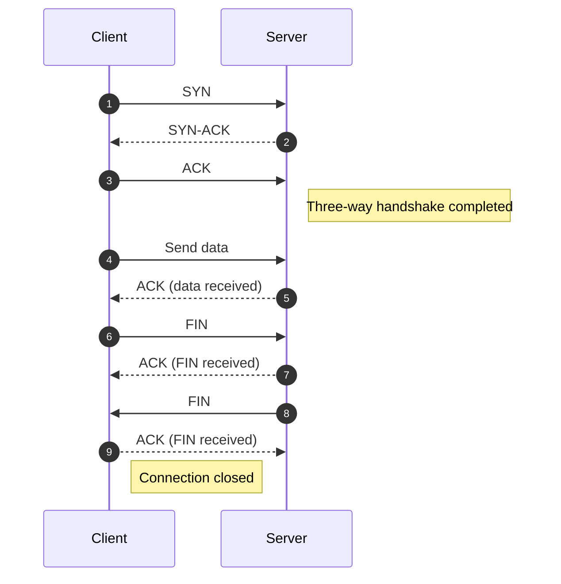

# Mermaid diagrams

```mermaid
sequenceDiagram
  autonumber
  Client->>Server: SYN
  Server-->>Client: SYN-ACK
  Client->>Server: ACK
  Note right of Server: Three-way handshake completed
  Client->>Server: Send data
  Server-->>Client: ACK (data received)
  Client->>Server: FIN
  Server-->>Client: ACK (FIN received)
  Server->>Client: FIN
  Client-->>Server: ACK (FIN received)
  Note right of Client: Connection closed

```