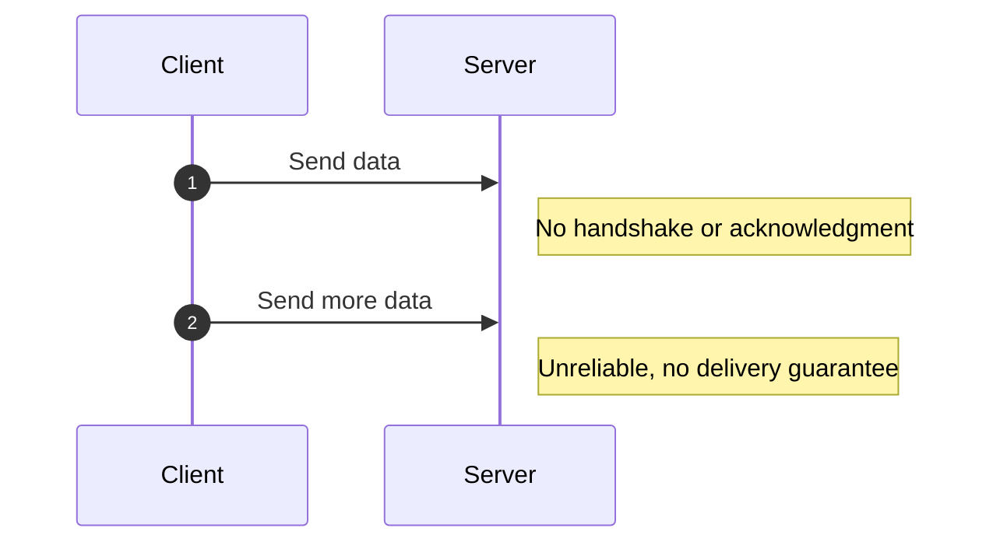
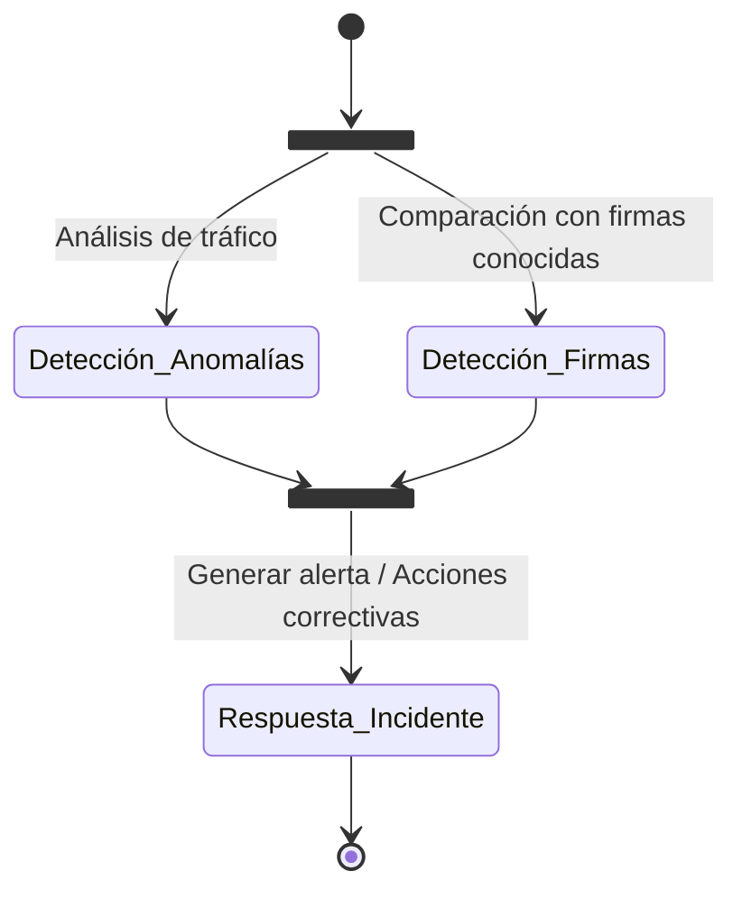

Se pueden realizar diferentes esquemas aunque es un poco complejo, aunque podemos hacerlo a mano, si es un esquema de algo que ya esta hecho, la mejor opción que tendremos es pasarle una plantilla base a una IA y pedirle a esta que te genere el esquema que quieres siguiendo esa plantilla.

Aunque parezcan imágenes, están hechos con texto plano.
## Diagrama de secuencia

## Diagrama de estados

Hay diagramas de clases y relacionales, pero al estar más relacionados directamente con bases de datos no los voy a añadir, pero desde este enlace puedes ver la documentacion de la plantilla [Más tablas](https://squidfunk.github.io/mkdocs-material/reference/diagrams/#using-flowcharts "Como poner más tablas").